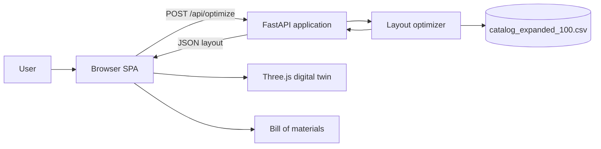

# Architecture

## Overview

KOHLER AI Bathroom Designer is a single-page browser application backed by a FastAPI service. The browser collects room requirements, sends them to the optimizer, renders the returned layout in Three.js, and provides interactive fixture inspection and water simulation.



## Repository Boundaries

```text
backend/main.py       HTTP boundary, validation, static file serving
backend/optimizer.py  Catalog scoring, selection, placement, response shaping
data/*.csv            Product catalog source of truth
frontend/index.html   Application structure and input controls
frontend/app.js       API calls, Three.js scene, interaction, simulation
frontend/styles.css   Visual system, layout, responsive rules
frontend/assets/      OBJ fixture models
Dockerfile            Python runtime image and Uvicorn entrypoint
```

## Runtime Components

### FastAPI application

`backend/main.py` creates the FastAPI application and exposes:

- `GET /api/health` for service health.
- `GET /api/catalog` for catalog access.
- `POST /api/optimize` for layout generation.
- `GET /` for the application shell.
- `GET /app.js` and `GET /styles.css` for frontend assets.
- `/static` for OBJ model assets and other static files.

The `OptimizeRequest` Pydantic model validates room dimensions, budget, theme, layout style, and the backward-compatible optional product field accepted by the API.

### Optimizer

`backend/optimizer.py` owns the planning domain logic:

1. Load the catalog with Pandas.
2. Score products using aesthetic and eco scores, with a theme preference bonus.
3. Select at most one product per category.
4. Apply budget and floor-clearance constraints.
5. Use PuLP/CBC when available.
6. Fall back to deterministic greedy selection if the solver is unavailable or cannot solve the model.
7. Place selected fixtures using layout-specific wall and wet/dry rules.
8. Return a JSON-ready response containing room data, fixtures, costs, space, water, power, and catalog count.

The maximum allocated floor area is calculated as 70% of room length multiplied by room width. Placement uses fixture footprints derived from catalog dimensions and enforces gaps and toilet centerline clearance.

### Browser application

The frontend is a module-based JavaScript application. It uses Three.js from a public CDN and is served by FastAPI as a static single-page app.

`frontend/index.html` provides:

- Room length, width, and budget inputs.
- Five design-language choices.
- Three layout-style choices.
- Solve button and result sections.
- Metrics, preliminary specifications, 3D viewport, fixture HUD, and BOM table.

`frontend/app.js` provides:

- `fetch` calls to `/api/optimize`.
- Room and fixture state management.
- Three.js renderer, camera, OrbitControls, lights, and scene lifecycle.
- Procedural fixture fallbacks and OBJ asset loading.
- Raycast-based fixture selection.
- Material finish changes.
- Water and shower simulation systems.
- Metrics, preliminary panel, and BOM rendering.

`frontend/styles.css` provides the dark/brass visual language, responsive layout, panels, controls, metrics, HUDs, tables, and reduced-motion behavior.

## Request And Render Flow

```mermaid
sequenceDiagram
    participant U as User
    participant UI as Browser UI
    participant API as FastAPI
    participant OPT as Optimizer
    participant CAT as CSV Catalog
    participant GL as Three.js

    U->>UI: Enter dimensions, budget, theme, layout
    U->>UI: Select Solve & Generate Layout
    UI->>API: POST /api/optimize
    API->>OPT: Validated request
    OPT->>CAT: Load catalog records
    CAT-->>OPT: Product data
    OPT->>OPT: Score, select, constrain, place
    OPT-->>API: JSON-ready layout
    API-->>UI: Layout response
    UI->>UI: Render metrics and BOM
    UI->>GL: Build room and fixture scene
    GL-->>U: Interactive 3D layout
```

## Layout Data Flow

The optimizer response has two conceptual layers:

```text
room
├── length_ft
├── width_ft
├── theme
├── budget
└── layout_style

fixtures[]
├── catalog fields
├── x_ft / y_ft
├── z_rotation
├── wall_orientation
├── footprint_width_ft / footprint_depth_ft
├── dimensions
└── telemetry_defaults
```

The browser uses `room` to build the floor, walls, seams, theme, and camera framing. It uses each `fixture` to choose a model, normalize the model into the room, attach interaction metadata, and render the fixture HUD and BOM row.

## Three.js Scene Lifecycle

1. `initScene()` creates the renderer, camera, controls, raycaster, lights, and animation loop.
2. `renderLayout()` stores the API response, updates UI values, and calls `buildScene()`.
3. `buildScene()` clears the prior room group, creates the floor and walls, applies the selected theme, and calls `addFixture()` for each returned fixture.
4. `addFixture()` creates a fixture group, loads a known OBJ asset when available, and uses a procedural fallback if loading fails.
5. Each mesh stores its fixture group in `userData` so raycasting can map a clicked mesh back to its catalog fixture.
6. The animation loop updates active water systems and renders the scene.
7. Re-solving removes the old room group and rebuilds the scene from the new response.

## Water Simulation Architecture

Water systems are attached to fixture groups through `group.userData.waterSystem`. The common water factory manages:

- Animated stream geometry.
- A fixture-specific water surface.
- Ripple rings.
- Caustic light spots.
- Steam particles.
- Drain vortex particles.
- Splash droplets.
- Pool fill level and color changes.
- Camera-distance auto-shutoff.

Foam and bubble systems are intentionally disabled. Particle and ripple effects are constrained using fixture dimensions or a configured basin radius. Bathtub water uses an inset rounded basin surface, and fixture water systems reset their fill state when switched off.

Showers use a separate water system for droplets, splash particles, mist, and floor caustics. Oversized shower glass planes are not rendered so the enclosure cannot obscure the room or bathtub view.

## Theme Application

The room theme is applied after room geometry is created. Theme data controls:

- Floor color and roughness.
- Wall color.
- Grout/seam color.
- Ambient light color and intensity.
- Key light color and intensity.
- Warm point-light color and intensity.

The browser selector currently exposes five themes even though the internal theme registry can support additional theme definitions.

## Deployment Topology

### Local Python

Uvicorn runs the FastAPI process directly. The process serves both API responses and the frontend, so no separate frontend server is required.

```text
Browser --> localhost:8000 --> Uvicorn --> FastAPI
                                      ├── API routes
                                      ├── frontend files
                                      ├── OBJ assets
                                      └── CSV catalog
```

### Docker

The Dockerfile uses `python:3.12-slim`, installs `requirements.txt`, copies `backend`, `frontend`, and `data`, exposes port 8000, and starts Uvicorn.

```text
Browser --> host port 8000 --> container port 8000 --> Uvicorn/FastAPI
```

The browser still needs access to the public CDN resources referenced by `frontend/index.html` for Tailwind, fonts, and Three.js modules.

## Failure And Fallback Behavior

- Invalid request values are rejected by Pydantic and returned as an API validation error.
- Optimizer failures are converted into an HTTP 500 response with an actionable detail message.
- If PuLP/CBC is unavailable, the optimizer uses deterministic greedy selection.
- If an OBJ asset fails to load, the fixture builder uses a procedural geometry fallback where one exists.
- If the browser cannot reach the backend, the frontend shows an unresolved-room error state.
- Water simulation automatically stops when the camera is too far from the active fixture.

## Testing Boundaries

`tests/test_api.py` verifies:

- Health route behavior.
- Optimize response contract.
- Catalog count.
- Budget and space limits.
- Supported fixture categories.
- Non-overlapping placement.

`smoke_test.py` makes an in-process request and prints the resolved fixture collection and totals. Browser-level rendering and visual regression tests are not currently included.
